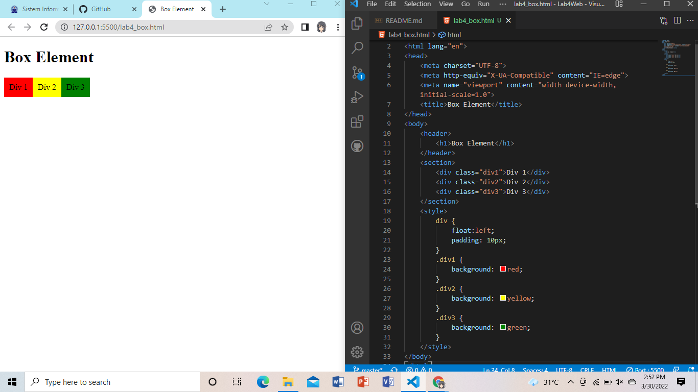
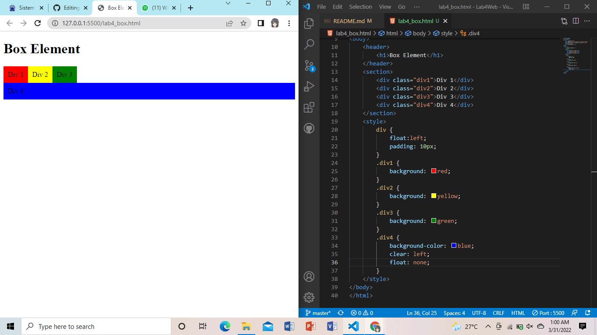

# Tugas Lab 4 Web
## Profil
| # | Biodata |
| -------- | --- |
| **Nama** | Alingga Reandito |
| **NIM** | 312010276 |
| **Kelas** | TI.20.A.2 |
| **Mata Kuliah** | Pemrograman Web |
## Langkah 1

### 1. Membuat Box Element
```html
<section>
        <div class="div1">Div 1</div>
        <div class="div2">Div 2</div>
        <div class="div3">Div 3</div>
</section>
```
CSS Float Property
```html
<style>
        div {
            float:left;
            padding: 10px;
        }
        .div1 {
            background: red;
        }
        .div2 {
            background: yellow;
        }
        .div3 {
            background: green;
        }
</style>
```
### Berikut Adalah hasilnya



### 2. Mengatur Clearfix Element
```html
<section>
        <div class="div1">Div 1</div>
        <div class="div2">Div 2</div>
        <div class="div3">Div 3</div>
        <div class="div4">Div 4</div>
</section>
<style>
        div {
            float:left;
            padding: 10px;
        }
        .div1 {
            background: red;
        }
        .div2 {
            background: yellow;
        }
        .div3 {
            background: green;
        }
        .div4 {
            background-color: blue;
            clear: left;
            float: none;
        }
</style>
```



### 3. Membuat Layout Sederhana 
```html